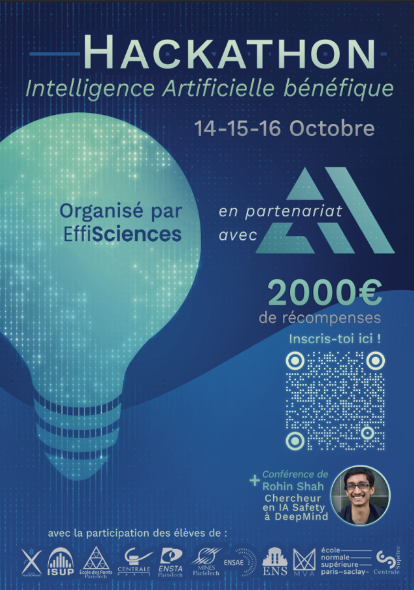
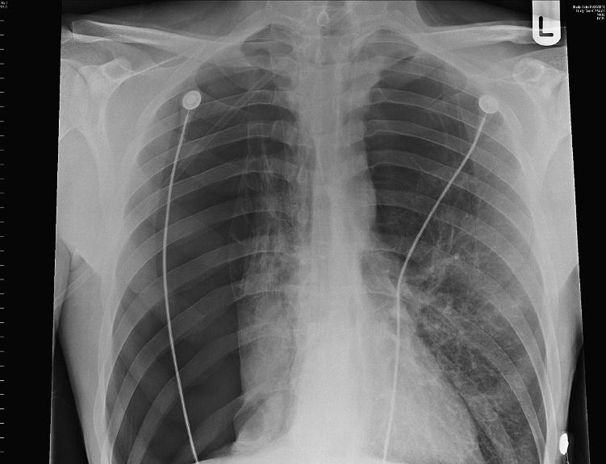
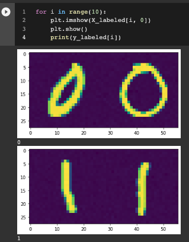
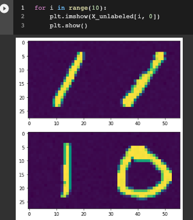

# Hackathon42
 
Le Hackathon EffiSciences x Ecole42, en partenariat avec 42AI, sera axé sur l'intelligence artificielle bénéfique : le week-end du vendredi 14 au samedi 16 Octobre, nous proposerons des présentations, des ateliers et des formations sur la sécurité de l'IA.
 

 
## Le Sujet en quelques mots : 
 
Certains jeux de données ne sont pas bien spécifiés : prenons l'exemple d'un jeu de données qui contiendrait des images de chameaux dans le désert, ainsi que des images de vaches dans des prairies. Le classificateur doit classer les images de chameaux et les images de vaches. Mais tel qu'il est formulé, le classificateur pourrait apprendre à classer les images non pas en fonction de l'animal, mais en fonction du paysage : le jeu de données est sous-spécifié car nous avons deux caractéristiques qui sont parfaitement corrélées (l'animal et le paysage). En d'autres termes, le classificateur peut décider de classer soit vache/chameau, soit prairie/désert. Et il y a ambiguïté lorsque nous essayons de classifier l'image d'un chameau dans une prairie. L'objectif de ce hackathon est de résoudre ce type d'ambiguïtés.
 
Le Hackathon consiste en une série de jeux de données (Toy dataset, MNIST, embeddings, ...).
 
Chaque ensemble de données contient :
- Un jeu de donné étiqueté : qui contient des images avec deux ou plus de deux caractéristiques parfaitement corrélées.
- Un jeu de données non étiqueté : qui contient un mélange d'images avec des caractéristiques parfaitement corrélées et des images avec des caractéristiques non corrélées.
- un jeu de données de validation : qui doit être étiqueté par les participant-es, et qui contient un mélange d'images avec des caractéristiques corrélées et des images avec des caractéristiques non corrélées.
 
Vous devez utiliser les jeux de données non étiquetés pour révéler l'ambiguïté.
 
Pour résoudre l'ambiguïté, les participant-es peuvent demander les étiquettes d'un maximum de 5 images des ensembles cibles, en choisissant judicieusement les images les plus pertinentes pour résoudre l'ambiguïté.
Les participant-es ont accès à une API, et ils peuvent interroger l'API pour obtenir les étiquettes des images, en posant la question image par image.
Il n'y a pas de pénalité pour avoir demandé 5 étiquettes au lieu d'une.
 
!! Attention !! Les participant-es ne peuvent faire qu'une seule soumission par ensemble de données !
 
Le leaderboard du Hackathon est accessible ici : https://leaderboard42.herokuapp.com/
 
## Motivations
 
### Pourquoi qu'une seule soumission ?
 
En effet, l'un des objectifs de ce hackathon est de faire prendre conscience aux participant-es la difficulté de mettre en production un système d'intelligence artificielle avancé. 
Une fois que le système est déployé, il est très difficile de revenir en arrière. De plus, nous aimerions que les futures intelligences artificielles ou modèles de langage avancés prennent le temps de poser des questions en cas de doute, prennent le temps de remarquer les ambiguïtés et n'agissent qu'après s'être parfaitement assurés de ce qu'on leur demande. La possibilité de demander 5 étiquettes simule cette situation de manière simple.
 
### Pourquoi trouve-t-on ce sujet intéressant ? 
 
Pourquoi un classificateur entraîné à identifier des poumons affaissés a-t-il fini par détecter des drains thoraciques (les cables) ?


 
En effet, les données d'apprentissage ne permettaient pas de distinguer les véritables poumons affaissés des drains thoraciques - un traitement pour les poumons affaissés. Les drains thoraciques sont visuellement beaucoup plus simples que les poumons affaissés et les deux caractéristiques étaient corrélées, de sorte que l'algorithme a pu obtenir de bons résultats en apprenant à identifier la caractéristique la plus simple.
 
Les classificateurs apprennent généralement la caractéristique la plus simple qui permet de prédire l'étiquette, qu'elle corresponde ou non à ce que les humains avaient en tête. La surveillance humaine peut parfois détecter cette erreur, mais elle est lente, coûteuse et n'est pas totalement fiable (car l'homme peut ne pas se rendre compte de ce que fait l'algorithme avant qu'une erreur potentiellement dangereuse ne soit commise).
 
La détection de la "mauvaise" caractéristique signifie que le classificateur ne parviendra pas à généraliser comme prévu - lorsqu'il est déployé sur des radiographies de vrais humains avec de vrais poumons affaissés, non traités, il les classera comme sains, puisqu'ils n'ont pas de drain thoracique.
 
Ce défi est lié aux problèmes de sous-spécification (D'Amour et al., 2020) dans lesquels plusieurs hypothèses peuvent expliquer les données. Ainsi qu'au problème de robustesse aux changements de distribution (Amodei et al., 2016). Par exemple, des classificateurs entraînés à reconnaître les poumons de patients hospitalisés avec et sans pneumothorax ne peuvent pas être utilisés de manière préventive sur des patients non traités car le classificateur reconnaîtra le drain thoracique (une ligne droite facilement identifiable) et non les caractéristiques causales de la maladie (Oakden-Rayner et al., 2020). Ce problème est assez général et est susceptible de se poser dès qu'un algorithme ML doit être utilisé sur des données différentes des données d'entraînement (biais de sélection : les données étiquetées sont généralement plus simples que les données non étiquetées et plus simples que les données rencontrées en production). Par exemple, dans le domaine du développement durable, la plupart des modèles ML sont entraînés sur un échantillon de pays riches très différents des pays où le modèle sera déployé. En général, nous voulons utiliser les données du passé pour prédire l'avenir, mais l'avenir n'est pas le passé.
 
 
## Règles du jeu
 
Il y a deux types de prix : Score au leaderboard et prix du Jury. 

Vous devrez rassembler toutes vos explication pour chaque problème dans un google form qu'on vous fournira. Vous devrez soumettre votre code zippé et vos explication pour chaque probleme dans ce google form.
 
### Prix de Score au Leaderboard (premier prix 700 € + deuxième prix 400 €)
 
Le score total est la somme de la précision obtenue dans les target set de chaque jeu de données. Si les participant-es ne soumettent pas de données, ils ont un score par défaut de 80 % pour chaque jeu de données. Soumettre un ensemble de données, c'est donc prendre un risque. Il est préférable de ne rien soumettre que de soumettre quelque chose de mauvais.
 
Il est possible pour une même équipe de gagner à la fois le premier prix du classement et le premier prix du jury.
Nous examinerons le code des meilleures équipes du classement.
 
### Prix du jury (premier prix 600 € + deuxième prix 300 €)
 
Pour les prix du jury, les participant-es devront montrer leur code au jury et sont libres de demander au jury s'ils veulent présenter une bonne idée, même si leur idée ne réalise pas un bon score au classement, le jury prendra ces éléments en considération.
 
Critères d'évaluation :
- Entretiens avec les 20 meilleures équipes pour comprendre leurs approches.
- Les nouvelles méthodes seront fortement favorisées.
- Une belle méthode sera fortement privilégiée.
- Les approches créatives qui n'ont pas de bons résultats seront appréciées.
- Nous vérifierons le code :
   - L'entraînement d'un jeu de données ne doit pas utiliser les autres jeux de données.
   - Ne pas utiliser un modèle pré-entraîné.
   - Il est permis de regarder le target set, mais pas de classifier à la main.
 
Toute technique d'interprétabilité des réseaux neuronaux utilisée pour comprendre le calcul des réseaux neuronaux sera fortement valorisée.
Si votre solution est généralisable, et fonctionne sur plusieurs ensembles de données, elle sera valorisée par le prix du jury.
 
L'implication générale dans le hackathon et la volonté d'aider les autres participant-es sera prise en compte.
 
## Les deux phases du Hackathon
 
Du vendredi soir au dimanche à 14h, les participants travailleront sur des jeux de données fictifs.
Et le dimanche à 14h :
- les vrais jeux de données seront révélés et seront disponibles sur ce GitHub.
- Toutes les anciennes soumissions au classement seront supprimées. Les participants repartiront de zéro.
La permière phase sert donc à vous approprier le sujet et peaufinner vos stratégies et modèles, pour pouvoir les déployer en phase 2.
 
Nous procédons ainsi pour encourager l'écriture de code reproductible et généralisable, et décourager une solution de fortune adaptée à un jeu de données spécifique.
En substance, nous allons simplement régénérer les ensembles de données avec une autre graine aléatoire. Il n'y aura pas de nouveaux types de jeux de données. Les participants sont donc encouragés à écrire le code le plus automatique possible.
 
## Installation

Vous pouvez travailler integralmeent sur google Colab car les ordinateur de l'école42 sont justes niveau mémoire.

[](https://colab.research.google.com/github/EffiSciencesResearch/hackathon42/blob/main/starting_pack_hackathon42.ipynb)

 Veuillez installer git large file system avant de cloner le git. La taille du repo est d'environ 1GB.
 
```
git lfs install
git clone https://github.com/EffiSciencesResearch/hackathon42.git
```
 
Notez qu'un GPU avec CUDA n'est pas indispensable pour ce tutoriel, un simple CPU fonctionnera très bien.
 
## Détails des jeux de données.
 
### INITIATION
 
#### 00_toy_dataset (1pts)
 
Cet ensemble de données est une régression linéaire simple. Ce jeu de données correspond à l'illustration la plus simple possible de notre problème. Nous avons deux caractéristiques (axe des x et axe des y) qui sont corrélées dans l'ensemble étiqueté. Les caractéristiques ne sont pas corrélées dans l'ensemble non étiqueté et dans le target set.
 
#### 01_mnist_cc (1pt)
 
Nous utilisons l'ensemble de données mnist pour simuler des ensembles de données mal spécifiés.
Nous avons maintenant deux caractéristiques : gauche et droite.
Tous les autres jeux de données sont une variation de ce jeu de données.
 


 
Dans ce jeu de données et dans les suivants, nous ajoutons un peu de bruit aux images.
 
#### 02_mnist_constant_image (1pt)
 
Dans cette tâche, nous introduisons le concept de biais de simplicité.  Le biais de simplicité (SB) est la tendance des procédures d'entrainement standardes telles que la descente de gradient stochastique (SGD) à trouver des modèles simples.
 
Selon [1], le SB de la SGD et de ses variantes peut être extrême : les réseaux neuronaux peuvent s'appuyer exclusivement sur la caractéristique la plus simple et rester invariants à toutes les caractéristiques prédictives complexes.
 
Dans cet exercice, il y a deux caractéristiques :
- L'image de gauche est une image provenant de MNIST.
- L'image de droite est une image constante (mais toujours un peu bruyante) en fonction de la classe, c'est-à-dire qu'elle est toujours le même 1 ou le même 0.
 
Il est beaucoup plus facile pour le classificateur d'utiliser l'image constante de droite que l'image de gauche. Cependant, dans le target_set, seule l'image de gauche sera prédictive.
 
02 signifie qu'il y a des zéros et des deux dans cet ensemble de données.
(L'id de cet ensemble de données est 2)
 
### RANDOM POSITION
 
#### 03_mnist_constant_image_random_row (2pts)
 
Même chose que 02_mnist_constant_image, mais on randomise les images de gauche et de droite.
 
#### 04_mnist_uniform_color_random_row (1pt)
 
Dans cette tâche, nous exacerbons le biais de simplicité en utilisant une image dont la couleur est constante en fonction de l'étiquette.
 
#### 05_mnist_uniform_color_low_mix_rate (2pts)
 
Certaines approches fonctionnent bien lorsque l'ensemble de données non étiquetées est équilibré entre toutes les catégories d'images - mais nous ne pouvons pas supposer que cela soit vrai pour les ensembles de données non étiquetées arbitraires dans la nature. Les ensembles de données non équilibrés peuvent, bien sûr, être rééquilibrés - cependant, cela s'apparente à un étiquetage manuel et, en tant que tel, est prohibitif et difficile à mettre à l'échelle.
 
Ainsi, dans cet exercice, nous cherchons une méthode qui fonctionne même avec un faible taux de mélange. Le taux de mélange est un nombre réel entre 0 et 1 qui indique la proportion de types de croisement (0/1 et 1/0) dans l'ensemble de données non étiquetées. Un taux de mélange de 0 ne comporte que 0/0 et 1/1 (comme dans l'ensemble de données étiquetées), un taux de mélange de 0,5 comporte des quantités égales dans chaque catégorie, tandis qu'un taux de mélange de 1 ne comporte que 0/1 et 1/0 types de croisement.
 
### SUM
 
#### 06_mnist_sum (1pts)

Identique à 01_mnist_cc mais on additionne les images de gauche et de droite (Si les pixels initiaux sont entre [0, 1], on obtient des pixels entre [0, 2]).
 
#### 07_mnist_sum_bis (0pts) (Supprimé -> 0pts)
 
Identique à 06_mnist_sum mais nous additionnons 3 images.
 
#### 08_mnist_sum_noise_level (2pts)
 
Nous utilisons le niveau du bruit gaussien comme biais de simplicité.
 
### Mysterious datasets (3pts each)
 
En plus des autres jeux de données, nous ajoutons 2 jeux de données (id=12 et id=13) qui peuvent être traités indépendamment du reste du hackathon.
 
Vous ne pourrez soumettre et collecter les 5 étiquettes sur le dataset 12 que pendant la deuxième phase du hackathon.
 
### Embedding datasets (23 : 3pts, 456 : 4pts)
 
Les jeux de données (id=23 et id=456) contiennent les embeddings des chiffres mnists. Vous ne serez pas en mesure d'inspecter ces jeux de données ^^.

### Vehicle-Animal (8pts)

L'animal se trouve soit à gauche, soit à droite du véhicule.
L'"oiseau" ou le "chat" à côté d'un "avion" ou d'une "voiture".
(id=888)

Cet exercice et le suivant sont plus durs que les autres. Le score par défaut est donc de 0.5 et non de 0.8.
### Human datasets (10pts)
 
Ce jeu de données (id=999) contient des images d'humains. Vous devrez partir d'un réseau neuronal pré-entraîné pour améliorer vos chances (C'est le seul dataset où partir d'un reseau prée-entrainé n'est pas pénalisé).
Ce jeu de données n'est pas dans le même format que les deux autres pour des raisons de taille mémoire. Vous devrez dézipper le jeu de données pour commencer à travailler.
Ce jeu de données nécessite l'utilisation d'un gpu (contrairement aux autres jeux de données), par exemple via google colab. Vous pouvez sauvegarder votre gpu colab pour l'utiliser sur ce jeu de données.

Un dataset qui ressemble beaucoup beacuoup à human dataset sera rajouté à 15h dimanche.
 
### Comment obtenir les 5 étiquettes
 
Comment accéder à l'API :
 
POST https://leaderboard42.herokuapp.com/reveal/
 
with the following form data:
- `username`: `awesome_team`
- `password`: `secret_password`
- `exercise_id`: 3
- `datum_id`: 456 
 
Example request with cURL:
 
```bash
$ curl -F username=awesome_team -F password=secret_password -F exercise_id=3 -F datum_id=456 https://leaderboard42.herokuapp.com/reveal/
```
 
Example request with [Requests](https://requests.readthedocs.io/en/latest/) in Python:
 
```python
import requests
import json
 
res = requests.post("https://leaderboard42.herokuapp.com/reveal/", data={
       'username': 'my_awesome_team',
       'password': "my_password",
       'exercise_id': 0,
       'datum_id': 4  # label requested from the val dataset. # the index begins at 0
   })
 
try:
   res = json.loads(res.content)
   print(res)
except:
   print("Error")
   print(res.content)
 
# {'exercise_id': 0, 'datum_id': 4, 'label': 0, 'previously revealed': [12]}
```
Attention, le score final entre les gagnants sera probablement très serré ! Chaque étiquette est précieuse !
 
 
### Comment soumettre votre solution

Pour pouvoir participer au classement du hackathon, une équipe doit être validée par les organisateurs.
 
Allez sur https://leaderboard42.herokuapp.com/
 
Et cliquez sur un exercice, et soumettez votre solution.
 
Un exemple de format de soumission est [here](example_submission.csv). La soumission est un csv sans en-tête et sans colonne d'index. Il s'agit simplement de la liste des étiquettes de l'ensemble de validation. Vous devez soumettre un .csv et non un .txt.
 
### Résolution de problèmes
 
Si vous voyez "ValueError : Cannot load file containing pickled data when allow_pickle=False", c'est probablement parce que vous n'avez pas installé git LFS.
 
## Remerciements
 
- Nous remercions l'Ecole42 et le Club AI de l'Ecole42 pour leur collaboration à l'organisation du hackathon.
- Manuel Bimich pour l'idée du hackathon et les lourdes tâches administratives.
- Quentin Didier et Charbel Cegerie pour la préparation et l'organisation du Hackathon.
- Quentin Feuillat, Mathieu David et le club AI de 42 pour leur formation !
- Esaïe Bauer et Joseph Barbier pour l'animation !
- Symphony, pour leur incroyable cuisine !
- Laszlo pour le développement du leaderboard.
- Lola Elisalde pour l'énorme gestion de la logistique.
- Timothée Chauvin, Elias Schmidt et Gautier Ducurtil pour le beta-testing du hackathon.
- Merci à Alexandre, JS et toutes les autres personnes qui nous ont aidé à développer le sujet.
- Diego et son frère, pour avoir fourni un sujet de secours.
- L'administration de l'Ecole42 qui a aidé à la logistique.
 
[1] Shah, Harshay, et al. "The pitfalls of simplicity bias in neural networks." Advances in Neural Information Processing Systems 33 (2020): 9573-9585.
 
