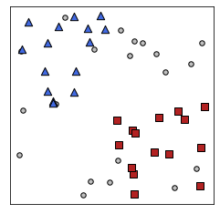

# hackathon42

The EffiSciences x Ecole42 hackathon will focus on Beneficial Artificial Intelligence: The weekend of Friday, October 14-16 will host presentations, workshops and training in AI Safety.

## The topic in a few words

Some datasets are not well specified: let's take an example of a dataset that would contain images of camels in the desert, as well as images of cows in grasslands. The classifier must classify between images of camels and images of cows. But formulated as it is, the classifier could learn to classify the images not according to the animal, but according to the landscape: the dataset is underspecified because we have two features that are perfectly correlated (animal and landscape). In other words, the classifier can either decide to classify cow/camel or grassland/desert. And there is ambiguity when we try to classify an image of a camel in a grassland. The goal of this hackathon is to resolve these types of ambiguities.

The hackathon consists of a series of datasets (Toy dataset, MNIST, embeddings, ...).

Each dataset contains:
- a labeled set: which contains images with two or more perfectly corelated features.
- an unlabeled set: which contains a mixture of images with perfectly corelated features and images with uncorrelated features
- a target set: which must be labeled by the participants, and which contains a mixture of images with corelated features and images with uncorrelated assets.

You must use the unlabeled sets to notice the ambiguity.

To resolve the ambiguity, participants can ask for the labels of up to 5 images from the target sets, choosing the most relevant images to resolve the ambiguity.
The participants have access to an API, and they can query the API to get the labels of the images, by asking the question image by image.
There is no penalty for requesting 5 labels instead of 1.

Warning. Participants can only make one submission per dataset!

The hackathon leaderboard can be found here: [TODO]

## Motivations

### Why only one submission?

Indeed, one of the goals of this hackathon is to make students aware of the difficulty of putting an advanced artificial intelligence system into production. Once the system is in production, it is very difficult to go back. In addition, we would like future artificial intelligences or advanced language models to take the time to ask questions when in doubt, take the time to notice ambiguity, and only act after being sure of the request. The opportunity to ask for 5 labels simulates this situation in a simple way.

### Why do we think this topic is interesting?

Why did a classifier that was trained to identify collapsed lungs end up detecting chest drains instead?


Because the training data was insufficient to distinguish actual collapsed lungs from chest drains – a treatment for collapsed lungs. Chest drains are visually far simpler than collapsed lungs and the two features were correlated, so the algorithm was able to perform well by learning to identify the simplest feature.

Classifiers will generally learn the simplest feature that predicts the label, whether it is what we humans had in mind, or not. Human oversight can sometimes catch this error, but human oversight is slow, expensive, and not fully reliable (as the humans may not even realise what the algorithm is actually doing before a potentially dangerous mistake is made).

Detecting the ‘wrong’ feature means that the classifier will fail to generalise as expected – when deployed on X-rays of real humans with real, untreated, collapsed lungs, it will classify them as healthy, since they don’t have a chest drain.

This challenge is related to underspecification problems (D'Amour et al., 2020) in which several hypotheses can explain the data. As well as the problem of robustness to distributional changes (Amodei et al., 2016). For example, classifiers trained to recognize the lungs of hospitalized patients with and without pneumothorax cannot be used preemptively on untreated patients because the classifier will recognize the chest drain (an easily identifiable straight line) and not the causative features of the disease (Oakden-Rayner et al., 2020). This problem is quite general and is likely to arise as soon as an ML algorithm is to be used on data different from the training data (selection bias: labeled data are generally simpler than unlabeled data and simpler than the data encountered in production). For example, in the area of sustainable development, most ML models are trained on a sample of rich countries very different from the countries where the model will be deployed. In general, we want to use past data to predict the future, but the future is not the past.


## Rules of the game

The total score is the sum of the accuracy achieved in the target sets of each data set. If participants do not submit data, they have a default score of 55% for each dataset. So submitting a dataset is taking a risk. It is better to submit nothing than to submit something bad.

Participants will have to show their code to the jury and are free to ask the jury if they want to pitch a good idea. Even if they don't have a good score on the leaderboard, the jury will take these elements into consideration.

Evaluation criteria:
- We make the people who are in the top 20 of the leaderboard
- Interviews with the top 20 teams to understand their approaches
- New methods will be strongly favored
- Creative approaches that do not have good results will be valued
- We check the code:
    - The training of a dataset must not use the other datasets
    - Do not use a pretrained model
    - It is allowed to look at the target set, but not allowed to classify by hand

## Installation

Please install git large file system begore cloning the git. The size of the repo is approximately 1Go.

```
git lfs install
git clone https://github.com/EffiSciencesResearch/hackathon42.git
```


## Dataset details

### INITIATION

#### 0_toy_dataset (2pts)

This dataset is a simple linear regression. This dataset corresponds to the simplest possible illustration of our problem. We have two features (x-axis and y-axis) which are corelated in the labeled set. The features are not corelated in the unlabeled set and in the target set (these two are in grey in the figure).



#### 01_mnist_cc (1pt)

We use the mnist dataset to simulate misspecified datasets.
We now have two features: left and right.
All other datasets are a variation of this dataset.


In this dataset and in the following ones, the images are slightly noisy.

#### 02_mnist_constant_image (1pt)

In this task, we introduce the concept of Simplicity bias.  Simplicity Bias (SB) -- the tendency of standard training procedures such as stochastic gradient descent (SGD) to find simple models.

According to [1], the SB of SGD and its variants can be extreme: neural networks can rely exclusively on the simplest feature and remain invariant to all complex predictive features.

In this exercise, there are two features:
- The left image is an image from MNIST
- The image on the right is a constant image depending on the class, i.e. it is always the same 1 or the same 0.

It is much easier for the classifier to use the constant image on the right than the image on the left. However, in the target_set, only the left image will be predictive.

### RANDOM POSITION 

#### 03_mnist_constant_image_random_row (2pts)

In this section, we randomize the left and right images + we add the simplicity bias problem.

#### 04_mnist_uniform_color_random_row (1pt)

In this task, we exacerbate the simplicity bias by using an image that is a constant color depending on the label.

#### 05_mnist_uniform_color_low_mix_rate (2pts)

Some approaches work well when the unlabeled dataset is balanced across all image categories - but we cannot assume this to be true for arbitrary unlabeled datasets in nature. Unbalanced datasets can, of course, be rebalanced - however, this is akin to manual labeling and, as such, is prohibitively expensive and difficult to scale.

Thus, in this exercise, we seek a method that works even with a low mixing rate. The mixing ratio is a real number between 0 and 1 that indicates the proportion of cross types (0/1 and 1/0) in the unlabeled data set. A mixture rate of 0 has only 0/0 and 1/1 (as in the labeled data set), a mixture rate of 0.5 has equal amounts in each category, while a mixture rate of 1 has only 0/1 and 1/0 cross types.

### SUM

#### 06_mnist_sum (1pts)

Same as 01_mnist_cc but we sum the left and right images.

#### 07_mnist_sum_bis (1pts)

Same as 06_mnist_sum but we sum 3 images.

#### 08_mnist_sum_noise_level (1pts)

We use the level of the gaussian noise as the simplicity biais.


### Mysterious datasets (5pts/mysterious dataset)

In addition to the previous datasets, we add 3 datasets (12, 13, 14) that can be processed independently, and independently with the rest of the hackathon.

These exercises are highly valued and it is possible to win without finding a technique to solve the problems associated with datasets 0-8.

### How to get the 5 labels

Revelation:

POST https://leaderboard42.herokuapp.com/reveal/

with the following form data:
- `username`: `awesome_team`
- `password`: `secret_password`
- `exercise_id`: 3
- `datum_id`: 456

Example request with cURL:

```bash
$ curl -F username=awesome_team -F password=secret_password -F exercise_id=3 -F datum_id=456 https://leaderboard42.herokuapp.com/reveal/
```

Example request with [Requests](https://requests.readthedocs.io/en/latest/) in Python:

```python
>>> import requests
>>> requests.post({uri}, data={{
        'username': 'awesome_team',
        'password': 'secret_password',
        'exercise_id': 3,
        'datum_id': 456
    }})
```


### How to submit your solution

Go to https://leaderboard42.herokuapp.com/

And click on one exercice, and submit your solution.

An example of submission format is in the the file: [example_submision.csv]


#### Bonus

Any neural network interpretability techniques used to understand neural network computation will be highly valued.
If your solution is generic, and works across datasets, it will be valued by the jury prize.


### Troubleshooting

If you see “ValueError: Cannot load file containing pickled data when allow_pickle=False”, it's probably because you didn't installed git LFS.

## Acknowledgements

We thank Ecole42 and the AI Club of Ecole42 for their collaboration in the organization of the hackathon.
Manuel Bimich for the hackathon idea and the heavy administrative lifting.
Joseph, and Quentin Didier for the preparation of the Hackathon.
Emile and Mathilde, for their incredible cooking!
Laszlo for the development of the leaderboard.
Quentin Feuillat and the AI club of 42!
Thanks to Alexandre, JS and all the other people who helped us to develop the subject.
Diego and his brother, for providing a backup topic.


[1] Shah, Harshay, et al. "The pitfalls of simplicity bias in neural networks." Advances in Neural Information Processing Systems 33 (2020): 9573-9585.